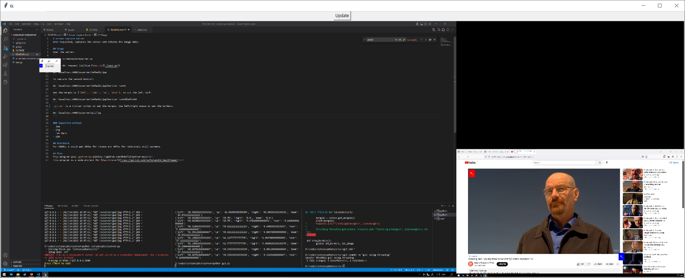

# Screen Capture Server
When requested, captures the screen and returns the image data.

## Usage
Open the server.
```
python screencaptureserver.py
```
Send a GET request (utilize [test.py](./test.py))
```
GET localhost:5000/scserver/default/jpg
```
To capture the second monitor:
```
GET localhost:5000/scserver/default/jpg?monitor_num=2
```
Set the margin by {`left`, `right`, `up`, `down`}. To cut the left half:
```
GET localhost:5000/scserver/default/jpg?monitor_num=2&left=50
```
`gui.py` is a simple tkinter script to set the margin. Use left/right mouse to set the borders.<br>

```
GET localhost:5000/scserver/gui/jpg
```

### Supported methods
- jpg
- png
- ppm

## Benchmark
For 1080p, I could get 20fps for videos and 30fps for relatively still screens.

## Misc
This program uses [python-mss](https://github.com/BoboTiG/python-mss)<br>
This program is a side project for [DepthViewer](https://github.com/parkchamchi/DepthViewer)<br>